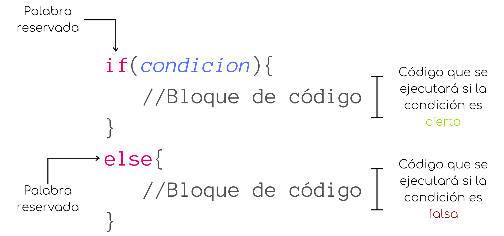

# Estructuras de Control en Programación
## ¿Qué son las Estructuras de Control?

Las estructuras de control son un conjunto de instrucciones que determinan el flujo de ejecución de un programa. En otras palabras, son las decisiones que el programa toma sobre qué camino seguir o qué acciones realizar en función de condiciones específicas. Estas estructuras son fundamentales en cualquier lenguaje de programación porque permiten crear programas dinámicos y capaces de reaccionar a diferentes situaciones.

Las estructuras de control se dividen en tres categorías principales:

1. **Estructuras de Selección (Condicionales)**
2. **Estructuras de Iteración (Bucles)**
3. **Estructuras de Control de Excepción**

A continuación, se describen estas estructuras en el contexto del lenguaje de programación JavaScript.

## 1. Estructuras de Selección (Condicionales)

Las estructuras de selección permiten tomar decisiones en función de condiciones específicas. En JavaScript, las más comunes son:

### 1.1. `if`, `else if`, `else`
La estructura `if` ejecuta un bloque de código si una condición es verdadera. El `else if` proporciona una condición adicional si la primera es falsa, y `else` se ejecuta si todas las condiciones anteriores son falsas.

#### 1.1.1 Notación tradicional
* Esquema gráfico 
  

* Código JS

    ```javascript
    let edad = 20;

    if (edad >= 18) {
        console.log("Eres mayor de edad.");
    } else if (edad > 12) {
        console.log("Eres adolescente.");
    } else {
        console.log("Eres un niño.");
    }
    ```
#### 1.1.2 Operador ternario    
* Esquema gráfico
  

* Código JS
    ```javascript
    let i = (15 % 3 == 0) ? "Si es múltiplo" : "No es múltiplo"; //i = "Si es múltiplo"
    ```

### 1.2. `switch`
El `switch` se utiliza para ejecutar diferentes bloques de código basados en el valor de una variable o expresión. Es útil cuando se comparan múltiples valores posibles.

* Esquema gráfico


* Código JS

    ```javascript
    let dia = 3;

    switch (dia) {
        case 1:
            console.log("Lunes");
            break;
        case 2:
            console.log("Martes");
            break;
        case 3:
            console.log("Miércoles");
            break;
        default:
            console.log("Otro día");
    }
    ```

## 2. Estructuras de Iteración (Bucles)

Las estructuras de iteración permiten repetir un bloque de código múltiples veces. En JavaScript, las más utilizadas son:

### 2.1. `for`
El bucle `for` se utiliza cuando conoces de antemano cuántas veces deseas ejecutar un bloque de código.

* Esquema gráfico


* Código JS
    ```javascript
    for (let i = 0; i < 5; i++) {
        console.log("Iteración " + i);
    }
    ```

### 2.2. `while`
El bucle `while` se ejecuta mientras una condición especificada sea verdadera. Se utiliza cuando no se sabe cuántas iteraciones serán necesarias.

* Esquema gráfico


* Código JS
    ```javascript
    let i = 0;

    while (i < 5) {
        console.log("Iteración " + i);
        i++;
    }
    ```

### 2.3. `do...while`
El bucle `do...while` es similar a `while`, pero garantiza que el bloque de código se ejecutará al menos una vez, ya que la condición se evalúa al final.

* Esquema gráfico


* Código JS
    ```javascript
    let i = 0;

    do {
        console.log("Iteración " + i);
        i++;
    } while (i < 5);
    ```

### 2.4. `for...in`
Este bucle itera sobre las propiedades enumerables de un objeto. Es útil para recorrer las claves de un objeto.

```javascript
let persona = { nombre: "Juan", edad: 25 };

for (let clave in persona) {
    console.log(clave + ": " + persona[clave]);
}
```

### 2.5. `for...of`
Este bucle itera sobre objetos iterables como arrays o strings.

```javascript
let numeros = [1, 2, 3, 4, 5];

for (let numero of numeros) {
    console.log(numero);
}
```

## 3. Estructuras de Control de Excepción

Estas estructuras permiten manejar errores y excepciones que ocurren durante la ejecución de un programa, garantizando que el programa no falle inesperadamente.

### 3.1. `try...catch`
Se utiliza para manejar excepciones. El bloque `try` contiene el código que puede lanzar una excepción, mientras que `catch` contiene el código que se ejecuta si ocurre una excepción.

* Esquema gráfico


* Código JS

    ```javascript
    try {
        let resultado = 10 / 0;
    } catch (error) {
        console.log("Ocurrió un error: " + error.message);
    }
    ```

### 3.2. `throw`
Permite lanzar una excepción de forma manual.

```javascript
let edad = 15;

if (edad < 18) {
    throw new Error("No eres mayor de edad.");
}
```

### 3.3. `finally`
El bloque `finally` se ejecuta después de `try` y `catch`, independientemente de si se produjo una excepción o no.

```javascript
try {
    let resultado = 10 / 0;
} catch (error) {
    console.log("Ocurrió un error: " + error.message);
} finally {
    console.log("Este bloque se ejecuta siempre.");
}
```

## Conclusión

Las estructuras de control son fundamentales para escribir código flexible y manejable en JavaScript. Permiten decidir qué código ejecutar y cuántas veces ejecutarlo, además de manejar situaciones excepcionales que puedan surgir durante la ejecución del programa. Comprender y dominar estas estructuras es esencial para cualquier programador.
